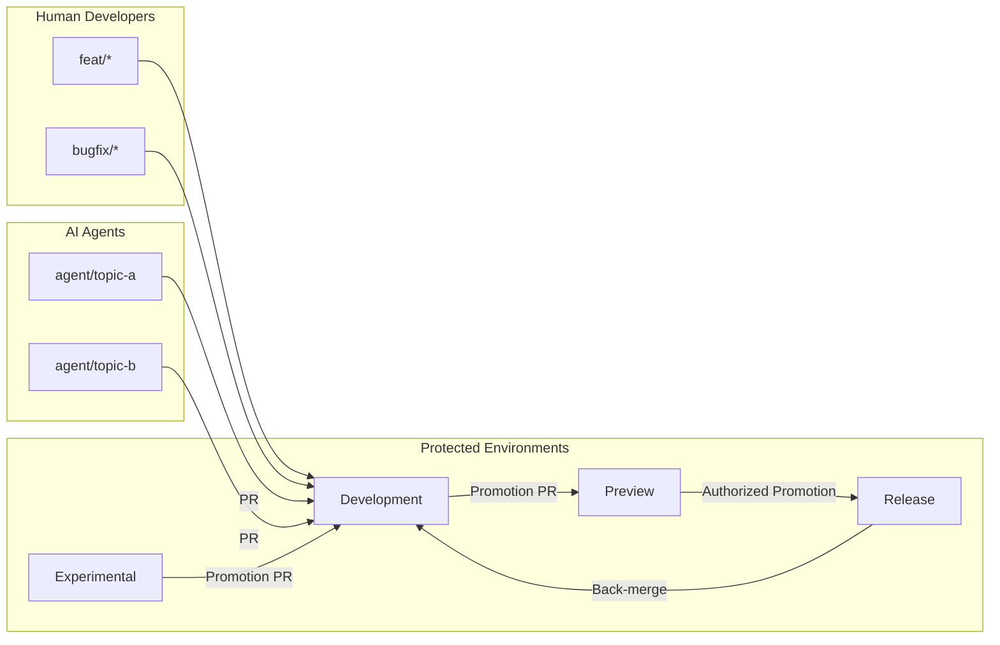

<!--
title: '🌿 BRANCHING STRATEGY & WORKFLOW'
description: 'The quad-tier branching model and the workflow for moving code to production.'
tags: [branching, workflow, git, conventions]
category: docs
-->

<!-- markdownlint-disable MD041 -->
<div align="center">

# 🌿 BRANCHING STRATEGY & WORKFLOW

<a name="top"></a>

**Architecting the path from local development to production stability.**

_Linear integration. Intentional promotion. Zero-downtime philosophy._

</div>

---

## 🎯 Our Strategic Model

We use a quad-tier long-lived branch architecture to isolate work-in-progress from user-facing environments. This structure follows a lineal promotion path: `Experimental` (the stable base) → `Development` → `Preview` → `Release`. This ensures that each stage of the lifecycle has a dedicated environment for validation. A repository generated from the template starts with `Development` as its default branch; the other three are created from it on Day 0 (see the initialization guide).

> [!IMPORTANT]
> **`Development` is the default branch.** All day-to-day integration must target this branch. Direct pushes to long-lived branches are strictly prohibited.

---

## 🏗️ Branch Architecture

<strong>🧱 Branch Types (what they're for)</strong>

| Branch                      | Purpose                                 | Who writes                    | How it changes                                                       | Deploy target       |
| --------------------------- | --------------------------------------- | ----------------------------- | -------------------------------------------------------------------- | ------------------- |
| **`Experimental`**          | Stable base                             | Nobody directly (via PR only) | Integration from upstream or core architecture shifts                | Sandbox             |
| **`Development`** (Default) | High-velocity integration line          | Nobody directly (via PR only) | **Promoted** from `Experimental`; Merges feat/bugfix branches        | Default environment |
| **`Preview`**               | Staging for validation and UAT          | Nobody directly (via PR only) | **Promoted** from `Development`; critical bugfix PRs allowed         | Preview environment |
| **`Release`**               | Production line; tagged versions        | Nobody directly (via PR only) | **Promoted** from `Preview`; emergency hotfix PRs allowed            | Production          |
| `feat/*`                    | New work (feature flags encouraged)     | Authors of the feature        | Rebase/merge with `Development` until ready; then PR → `Development` | None                |
| `bugfix/*`                  | Fixes for issues discovered pre-release | Authors of the fix            | PR → `Development` (or `Preview` if needed)                          | None                |
| `hotfix/*`                  | Emergency production fixes              | Release managers + owners     | PR → `Release` (then back-merge)                                     | Production          |
| `experiment/*`              | Prototypes/spikes                       | Authors                       | PR → `Development` (guarded behind flags)                            | None                |

---

<strong>🔀 Naming & Commit Style</strong>

- Branch names:
  `feat/<topic>`, `bugfix/<ticket>`, `hotfix/<ticket>`, `experiment/<idea>`, `chore/<task>`.
  A prefix states what the work **is**, which is why no tool or vendor name
  belongs in the list.
- One exception, and it is compatibility rather than convention: an automated
  coding tool that opens a pull request names the branch after itself, does not
  read this standard, and offers no setting to change it. Those prefixes are
  accepted through a separate `agent-prefixes` input so the convention above
  stays about intent. Failing such a branch would punish the author for their
  tool's naming, and renaming it by hand breaks the tool's own tracking.
- Conventional Commits (for readable history & automated notes):
  `feat(auth): add passwordless sign-in`, `fix(payments): handle webhook retries`, `chore(deps): bump firebase`.

---

<strong>🧭 Allowed Flows (what can merge where)</strong>

| From           | To            | Allowed? | Notes                                         |
| -------------- | ------------- | :------: | --------------------------------------------- |
| `feat/*`       | `Development` |    ✅    | Primary path for new work (via PR)            |
| `bugfix/*`     | `Development` |    ✅    | Usual fix path (via PR)                       |
| `bugfix/*`     | `Preview`     |    ⚠️    | Only if needed to unblock a release candidate |
| `experiment/*` | `Development` |    ✅    | Keep behind feature flags                     |
| `Experimental` | `Development` |    ✅    | **Promotion** / Base sync via PR              |
| `Development`  | `Preview`     |    ✅    | **Promotion** via PR after checks             |
| `Preview`      | `Release`     |    ✅    | **Promotion** with approval; tag after        |
| `hotfix/*`     | `Release`     |    ✅    | Emergency only; back-merge required           |
| `Release`      | `Preview`     |    🔁    | Optional back-merge if diverged               |
| `Release`      | `Development` |    🔁    | **Required** after hotfix or tag              |
| `Preview`      | `Development` |    🔁    | Back-merge after release as needed            |

Legend: ✅ allowed • ⚠️ restricted • 🔁 back-merge

---

<strong>🗺️ Lifecycle Diagram (high-level)</strong>



---

<strong>✅ Branch Protection (the shipped ruleset)</strong>

| Rule                                                  | Development | Experimental |  Preview  |  Release  |
| ----------------------------------------------------- | :---------: | :----------: | :-------: | :-------: |
| Require PR before merge (squash-only)                 |     ✅      |      ✅      |    ✅     |    ✅     |
| Required checks (lint/test/build + secret scan + DCO) |     ✅      |      ✅      |    ✅     |    ✅     |
| Restrict pushes (no direct push, no deletion)         |     ✅      |      ✅      |    ✅     |    ✅     |
| Restrict force-push (see note)                        | owner-only  |  owner-only  |    ✅     |    ✅     |
| Required reviews                                      |  0 shipped  |  0 shipped   | 0 shipped | 0 shipped |

> [!NOTE]
> **Force-push is owner-only on the integration line.** `Preview` and `Release` are force-push-immutable for everyone. On `Development` and `Experimental` force-push is blocked for everyone **except the repository owner** (the integration ruleset grants the Repository-admin role a full ruleset bypass - which, among other things, permits the force-push), which is what lets the owner normalize the generation root commit at Day 0. See [Branch Protection](../operations/Branch-Protection.md) for the two shipped rulesets.

> [!NOTE]
> **Why 0 reviews ship**: solo maintainers and automation PRs (dependency bumps, the formatting sweep) must never deadlock - CI still gates every merge. **Recommended hardening as the team grows**: raise required reviews to ≥1 (code owners for risky changes on `Preview`, release-manager approval on `Release`), require branches to be up to date with the base, and enable signed commits.

> [!TIP]
> Keep local commands and CI identical to avoid "works on my machine". Whatever your project runs for lint, test and build, CI should invoke exactly that, which is why `ci.yml` takes the commands rather than assuming them.

---

<strong>🚦 Everyday Developer Flow</strong>

### 1. The Starting Line

```bash
git switch Development && git pull --ff-only
git switch -c feat/topic-name
```

### 2. High-Frequency Integration

Keep your topic branch fresh by rebasing on `Development` regularly. This minimizes conflict debt.

```bash
git fetch origin
git rebase origin/Development
git push --force-with-lease
```

### 3. The PR Process

> [!TIP]
> Use **Squash Merges** for all PRs into `Development`. This collapses your working history into a single, high-signal commit that follows [Conventional Commits](https://www.conventionalcommits.org).

---

<strong>🚢 Promotion & Tagging</strong>

1. **Promotion**: Move `Development` → `Preview` via PR.
2. **Validation**: Perform QA and E2E checks on the Preview URL.
3. **Delivery**: Promote `Preview` → `Release`.
4. **Versioning**: Create an annotated tag (e.g., `v1.2.0`) and generate the release notes.
5. **Synchronization**: Back-merge `Release` into `Development`.

---

<strong>🔧 Hotfix Protocol (production incident)</strong>

1. Create `hotfix/<ticket>` from `Release`.
2. Minimal fix; add tests; open PR → `Release`.
3. After merge, **tag patch** (e.g., `v1.2.1`) and **back-merge** into `Development` (and `Preview` if needed).
4. Consider a follow-up `bugfix/` to refactor if the change was rushed.

> [!CAUTION]
> Don't batch unrelated fixes in a hotfix PR. Keep scope tiny to minimize blast radius and simplify rollback.

---

<strong>🧨 Conflict & Divergence Handling</strong>

- Prefer **rebase** to keep topic branches linear: `git rebase origin/Development` → fix → `git push --force-with-lease`.
- After release, if `Preview` diverged, **back-merge** from `Release` or re-promote `Development → Preview`.

---

<strong>🧰 Useful Commands (copy/paste)</strong>

### Topic Branch Synchronization

```bash
git fetch origin
git rebase origin/Development
git push --force-with-lease
```

### Opening a Pull Request

Open a Pull Request targeting `Development`. Ensure the description links to relevant issues and clearly states the risk profile.

---

<strong>🧪 Quality Gates (what must be green)</strong>

- **Lint**: `make lint` (Prettier check) passes.
- **Tests**: `make test` passes.
- **Build**: `make build` succeeds.
- **Security**: CodeQL analysis, Gitleaks secret scan, and Dependency Review report no new findings.
- **Hygiene**: the PR title follows Conventional Commits; spell check and link check are clean.

---

<strong>❓ Frequently Asked Questions (FAQ)</strong>

- **Why is `Development` the default branch?**
  Safer integration and simpler PR targeting; promotions make `Release` stable and auditable.

- **When can I merge to `Preview` directly?**
  Rarely - only critical fixes to unblock a release candidate.

- **Do we allow merge commits?**
  No - squash is the **only** merge method. The rulesets allow nothing else on the four protected branches, and init disables merge commits and rebase-merges repository-wide, so the option never even appears in the merge button.

---

### 🔗 See also

> [!TIP]
> Every canonical guide is indexed in the [&#x1F4DA; Standards Index](https://github.com/tannergolden/standards/blob/Development/docs/README.md). If you rename or move a file, update every reference to it across the repository to prevent link drift.

---

<div align="center">

**Branching for velocity. Merging for integrity.**

[↑ Back to Top](#top)

<br />

Built with ❤️ by the Engineering Team. Distributed under the MIT License.

</div>
