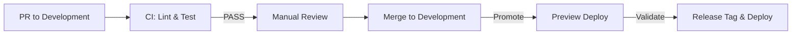

<!--
title: '📝 CONTINUOUS INTEGRATION & DELIVERY'
description: 'How CI and delivery are wired, from pull-request checks to release workflows.'
tags: [ci-cd, delivery, automation, pipelines]
category: docs
-->

<!-- markdownlint-disable MD041 -->

# 📝 CONTINUOUS INTEGRATION & DELIVERY

**Automating validity and velocity through hardened pipelines.**

_Deterministic builds. Automated validation. Secure promotion._

---

## 🎯 Our Strategic Objective

- **Fast feedback** on every Pull Request (PR): install → lint → test → build.
- **Deterministic builds** with pinned versions and lockfiles.
- **Intentional promotions**: `Development` (integrate) → `Preview` (validate) → `Release` (production).

---

<strong>🗺️ Branch → Environment Map</strong>

| Branch        | Purpose                         | GitHub Environment                  | Typical Action                     |
| ------------- | ------------------------------- | ----------------------------------- | ---------------------------------- |
| `Development` | Team integration line           | none (CI only)                      | CI only (no deploy by default)     |
| `Preview`     | Staging/User Acceptance Testing | `preview`                           | Deploy preview on push             |
| `Release`     | Production line (tagged)        | `release` (created + gated by init) | Build, tag, create release, deploy |

> [!TIP]
> If you need a dev sandbox, add a lightweight deploy on `Development`, but keep it optional to preserve speed.

---

<strong>🔍 Required Checks (set in Branch Protection)</strong>

The shipped rulesets require these three status checks - the job names below are the exact contexts the rulesets reference:

| Required check            | Source workflow   | Why it exists                                                                      |
| ------------------------- | ----------------- | ---------------------------------------------------------------------------------- |
| **🧪 Lint, Test & Build** | `ci.yml`          | One deterministic job: lint, then test, then build, using the commands you give it |
| **🔍 Scan for Secrets**   | `gitleaks.yml`    | Blocks any PR that introduces a credential or token                                |
| **✍️ DCO Sign-Off**       | `semantic-pr.yml` | Blocks any PR whose human-authored commits lack `Signed-off-by:`                   |

If you add project-specific gates (typecheck, coverage thresholds, E2E), add their job names to the ruleset's required checks - and keep the job `name:` stable, because renaming a job silently un-requires it.

---

<strong>🧭 Pipeline Overview</strong>

---

<strong>📦 Standard CI (for PRs and Development)</strong>

The template ships with `.github/workflows/checks.yml` (**🚦 Checks**), whose `ci` job calls the **✨ CI Validation** reusable workflow on pushes and pull requests to all four long-lived branches:

- **🧪 Lint, Test & Build** - the required gate. It runs the `lint-command`, `test-command`, and `build-command` you pass it, falling back to the `lint`, `test`, and `build` targets of a `Makefile` if you have one. If every stage resolves to nothing it **fails**, rather than reporting a green check that checked nothing.
- **📝 Check Spelling** - `typos` catches misspellings across code and docs.
- **🔗 Check Links** - `lychee` validates every link (advisory; see [Link Checker](automation/Link-Checker.md)).
- **📦 Dependency Review** - blocks a pull request that introduces a dependency with a known vulnerability. Pull requests only, since it compares two commits.
- **📄 REUSE Compliance** - verifies SPDX licensing information on every file in the tree. Off by default; enable it with the `reuse-check` input where a repository already carries SPDX headers and a `LICENSES/` folder.

Dedicated companions cover the rest of the surface: `gitleaks.yml` (required secret scan), `codeql.yml` (static analysis), `lint-workflows.yml` (`actionlint` and `zizmor` on workflow changes), and `semantic-pr.yml` (Conventional-Commit pull request titles, `<type>/<topic>` branch names, and DCO sign-offs). Dependency review runs as a job inside `ci.yml` rather than as a workflow of its own.

---

### Preview Deploy Strategy (Push to Preview)

The template ships with `.github/workflows/preview-deploy.yml`:

**Key Steps**

- **Triggers**: Runs automatically on any push to the `Preview` branch and can also be triggered manually via `workflow_dispatch`.
- **Deployment Job**: A single job (`deploy`) runs on an `ubuntu-latest` runner and is associated with the `preview` GitHub Environment.
  - **Checkout**: Checks out the specific branch that triggered the workflow.
  - **Setup, Install, Build**: Follows the same standard sequence as the CI workflow to prepare the application artifacts.
  - **Deploy**: A placeholder step that should be replaced with the project's actual deployment commands (e.g., syncing to a cloud storage bucket, deploying to a serverless platform).
  - **Failure Reporting**: A catch-all failure step reports any failed run, ensuring that issues are clearly communicated.

---

<strong>🚢 Release Drafting & Publishing</strong>

Releases are a two-stage, changelog-driven flow powered by [git-cliff](https://git-cliff.org/) - versions are computed from Conventional Commit history, never hand-edited into `package.json`:

1. **📋 Draft Release Notes** (`release-notes.yml`) - weekly (Monday 05:00 UTC) or on manual dispatch, git-cliff calculates the next SemVer from commit history and refreshes **one evolving draft** GitHub Release per branch: superseded drafts in the branch's tag namespace are pruned automatically, so the Releases page never piles up.
2. **🚀 Publish New Release** (`release-publish.yml`) - when a maintainer publishes that draft, the workflow builds the project **without caches** (a supply-chain defense: release artifacts never trust a cache another workflow could have poisoned), packages the build into `release/*`, and attaches it via `softprops/action-gh-release`, keeping the drafted notes as the release body. On a manual `workflow_dispatch` it additionally computes the next version and regenerates the changelog itself. Production deployment is intentionally yours to wire - extend this workflow or add one triggered on `release: published`.

A third stage exists for anything consumed from a package registry rather than from a tag: **📦 Publish Package** (`publish-package.yml`) pushes to npm, PyPI, crates.io, or any OCI registry, as four opt-in jobs. It is deliberately separate from `release-publish.yml`, because attaching a tarball to a GitHub Release and publishing to a registry are different deliverables with different credentials and different failure modes. A library wants both stages; a project consumed by tag wants only the first two.

Every action in these workflows is pinned to a full commit SHA, and **the two release stages are inert in the template repository itself** - there, `Development` is the released version, so a job-level guard limits drafting and publishing to repositories created from the template. The mechanics - version calculation, tag prefixes, and the packaging-time README cleanup - are covered in [Releases & Versioning](Releases-&-Versioning.md).

> [!TIP]
> Your Conventional Commits are the release notes: `feat:` and `fix:` commits become changelog entries automatically, grouped by type via `config/cliff.toml`.

---

<strong>🧰 Quality Gates & Speed Tips</strong>

- **Keep CI deterministic**: `.nvmrc`, lockfiles, pinned tool versions.
- **Cache wisely**: cache the package manager's own store rather than the installed dependency tree, and key it on the lockfile. Most `setup-*` actions do this for you when pointed at one.
- **Fail fast**: run lint/tests before build if build is expensive.
- **Matrix** (optional): test multiple Node.js Long-Term Support (LTS) versions only if you support them.
- **Short logs**: redact secrets; avoid verbose debug unless failing.

---

<strong>🔐 Secrets, Permissions, & Approvals</strong>

- Store secrets in **GitHub Environments** (`preview`, `release` - the `release` environment is created and branch-gated to `Release` automatically at init).
- Use **OpenID Connect (OIDC)** (`id-token: write`) to issue cloud tokens without static keys when possible.
- Require **reviewers** for the `preview`/`release` environments to gate deployments.
- Restrict who can trigger promotions (CODEOWNERS + environment rules).

---

<strong>🔄 Promotions & Rollbacks</strong>

- Promote by PR: **Development → Preview** then **Preview → Release**.
- Tag after promoting to `Release`.
- Roll back by **reverting the PR** or **redeploying the previous tag**; keep artifacts for a short retention window.

---

<strong>🧪 Health & Observability (recommended)</strong>

- Add smoke tests after deploy (ping health endpoint, basic navigation).
- Build provenance is attested automatically at publish (public repositories) - see `release-publish.yml`.
- Emit release metadata (version, commit SHA) to logs/telemetry.

---

<strong>❓ Frequently Asked Questions (FAQ)</strong>

- **Why use `npm ci` instead of `npm install` in CI?**
  It installs exactly what the lockfile specifies, ensuring reproducibility.

- **How do I block deploys on failing checks?**
  Make the CI job a **required status check**, and set environment **required reviewers**.

- **Where should I put provider-specific steps?**
  Staging: the placeholder `Deploy` step in `preview-deploy.yml`. Production: extend `release-publish.yml` after packaging, or add a workflow triggered on `release: published` that deploys the attached artifacts.

---

### 🔗 See also

> [!TIP]
> Every canonical guide is indexed in the [&#x1F4DA; Standards Index](https://github.com/tannergolden/standards/blob/Development/docs/README.md). If you rename or move a file, update every reference to it across the repository to prevent link drift.

---

**Built for speed. Validated for scale.**

[↑ Back to Top](#top)

 

Built with ❤️ by the Engineering Team. Distributed under the MIT License.

