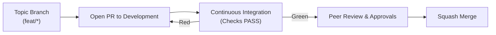

<!--
title: '🤝 PULL REQUESTS & CODE REVIEWS'
description: 'Pull-request etiquette and the code review rubric.'
tags: [pull-requests, reviews, workflow, quality]
category: docs
-->

<!-- markdownlint-disable MD041 -->

# 🤝 PULL REQUESTS & CODE REVIEWS

**Fostering engineering excellence through rigorous collaborative review.**

_Small changes. Clear intent. Zero-friction reviews._

---

## 🎯 Our Strategic Objectives

We treat every Pull Request as an atomic unit of change. High-quality PRs reduce cycle time, minimize technical debt, and ensure that the `Development` branch remains stable and deployable at all times.

- **Integrate Early**: Target `Development` with small, single-purpose changes.
- **Automate First**: Let Continuous Integration (CI) handle the mundane checks.
- **Review with Intent**: Focus on correctness, security, and architectural alignment.

---

## 🗺️ Pull Request (PR) Lifecycle

Our workflow ensures that no code reaches integration without validation and human oversight.

---

## ✍️ Author Checklist (Before "Request Review")

Before requesting review, ensure your PR meets the following "these standards" criteria:

| Category      | Requirement                                                  | ✅  |
| :------------ | :----------------------------------------------------------- | :-: |
| **Scope**     | Single intent; < 300 LOC; ≤ 10 files.                        |     |
| **Parity**    | Local checks (`make setup`, `make test`) are green.          |     |
| **Security**  | No secrets; addresses all scanner alerts.                    |     |
| **Context**   | Description includes _Impact_, _Validation_, and _Rollback_. |     |
| **Artifacts** | Screenshots or clips included for all UI changes.            |     |

---

## 🔍 Reviewer Checklist & Rubric

Reviewers should focus on these key facets to ensure maintaining the repository's hygiene.

| Facet           | What to Verify                                                | Priority     |
| :-------------- | :------------------------------------------------------------ | :----------- |
| **Correctness** | Does the logic handle edge cases and fulfill the requirement? | **Blocking** |
| **Security**    | Are secrets handled correctly? Is least-privilege applied?    | **Blocking** |
| **Readability** | Is the code self-documenting? Are small functions used?       | **High**     |
| **Testability** | Does the PR include adequate Unit/Integration coverage?       | **Blocking** |
| **Parity**      | Does it follow established patterns?                          | **Medium**   |

---

## 💬 Effective Communication

Use structured tagging in reviews to clarify intent and priority.

- **`[BLOCKER]`**: A critical issue that must be addressed before approval.
- **`[SUGGESTION]`**: A non-blocking improvement or alternative approach.
- **`[NIT]`**: A minor style or naming tweak; non-blocking.
- **`[QUESTION]`**: Clarification needed on intent or implementation.

> [!TIP]
> Use the **[Draft]** state for early feedback. When your PR is ready for formal review and all CI checks are green, convert it to **[Ready for Review]**.

---

## 🧑‍⚖️ Approvals & Merge Policy

- **All status checks must pass.** The rulesets require **🧪 Lint, Test & Build**, **🔍 Scan for Secrets**, and **✍️ DCO Sign-Off** to be green before any merge into `Development` - an unsigned human commit blocks the merge.
- **Approvals**: the shipped rulesets set **0 required approvals** so solo maintainers and automation PRs are never deadlocked. Teams should raise this to **1+** (and lean on `CODEOWNERS`) as soon as a second maintainer exists - see [Branch Protection](../operations/Branch-Protection.md).
- **Squash merge** by default; preserve a clean linear history.
- **Back-merge** after hotfixes to keep environment lines aligned.

---

## 🧰 GitHub Actions - PR Workflows

### 1. `semantic-pr.yml` - Semantic Pull Request

Enforces the Conventional Commits specification for every pull request title, so the squash commit (which inherits the title) feeds clean data to the changelog engine - companion jobs validate the source branch name (`<type>/<topic>`) and the mandated DCO `Signed-off-by:` trailer on every human commit. See [Semantic PRs & Auto-Formatting](automation/Semantic-PRs-&-Auto-Formatting.md).

### 2. `governance.yml` - Onboarding, Triage & Staleness

One workflow, three PR-facing jobs: **👋 Contributor Welcome** greets first-time contributors, **📥 Triage & Labeling** auto-labels PRs by touched area (`labeler.yml`) and by size, and **🕰️ Stale Management** sweeps inactive items. See [Contributor Onboarding](automation/Contributor-Onboarding.md) and [Triage & Labeling](automation/Triage-&-Labeling.md).

### 3. `auto-format.yml` - Code Style Formatter

Proposes Prettier fixes as a pull request rather than force-pushing to your branch, so formatting changes go through the same review gates as everything else.

---

## 🌿 The Pull Request Becomes The Commit

The squash commit is assembled for you: init configures the repository so the commit **title is the pull request title** and the **body is the pull request body**. Perfect those two fields rather than hand-editing at merge time, because the Semantic PR gate already validates the title as a **Conventional Commit** and the body is the only place the reasoning survives. This is also what drives the automated **Release Notes**, so a vague pull request body becomes a vague changelog entry.

> [!TIP]
> **Naming**: a rejected title or commit message is a formatting failure, not a review failure. The format, the required scope and the required body are specified in [&#x1F33F; Conventional Commits](Conventional-Commits.md).

---

### 🔗 See also

> [!TIP]
> Every canonical guide is indexed in the [&#x1F4DA; Standards Index](https://github.com/tannergolden/standards/blob/Development/docs/README.md). If you rename or move a file, update every reference to it across the repository to prevent link drift.

---

**Peer-reviewed for precision. Merged for scale.**

[↑ Back to Top](#top)

 

Built with ❤️ by the Engineering Team. Distributed under the MIT License.

