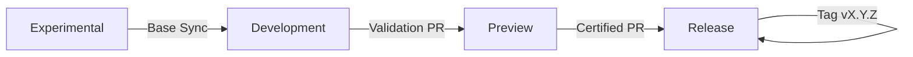

<!--
title: '🚢 RELEASES & VERSIONING'
description: 'How releases are cut, versioned, and published.'
tags: [releases, versioning, semver, changelog]
category: docs
-->

<!-- markdownlint-disable MD041 -->
<div align="center">

# 🚢 RELEASES & VERSIONING

<a name="top"></a>

**Scaling software delivery with semantic precision.**

_Immutable tags. Automated changelogs. Reliable rollbacks._

</div>

---

## 🎯 Our Delivery Philosophy

We treat every production release as a permanent milestone. Our process is designed to ensure that every version is traceable, auditable, and easily reversible if issues arise.

- **Accountability**: Only tag from the `Release` branch after validated promotion.
- **Automation**: Use Conventional Commits to derive version bumps and draft notes.
- **Stability**: Never reuse a version tag or modify a tag once pushed.

---

## 🔢 Versioning Policy (SemVer)

We strictly adhere to `MAJOR.MINOR.PATCH` increments based on the intent of the changes merged since the last milestone.

| Type      | Indicator                      | Impact                                                   |
| :-------- | :----------------------------- | :------------------------------------------------------- |
| **MAJOR** | `feat!:` or `BREAKING CHANGE:` | Incompatible API or structural changes.                  |
| **MINOR** | `feat:`                        | New functionality added in a backward-compatible manner. |
| **PATCH** | `fix:`, `perf:`, `chore:`      | Backward-compatible bug fixes and maintenance.           |

---

## 🏔️ Versioning Milestones

The project lifecycle moves through standardized phases to coordinate testing and integration.

The automated tagging derives the **release level from the version number itself** (not from the branch): versions below `0.7.5` tag as `development`, `0.7.5` and above as `preview`, and `1.0.0` and above as `release`.

| Level           | Version threshold | What it signals                       |
| :-------------- | :---------------- | :------------------------------------ |
| **development** | `< 0.7.5`         | High-velocity integration & features. |
| **preview**     | `>= 0.7.5`        | Feature-complete staging.             |
| **release**     | `>= 1.0.0`        | Final production stable.              |

---

## 🏷️ The Information-Rich Tag

Automated tags are designed to provide maximum context at a glance.

> [!NOTE]
> Format: `v{Version}-{Level}.{YYMMDDHHMM}.g{ShortSHA}` - where `{Level}` is `development`, `preview`, or `release`, computed from the version thresholds above (a manually dispatched tag may carry a branch name instead).
>
> **Example**: `v0.1.0-development.2601072132.g7b3f1a`

---

## 🗺️ Promotion & Delivery Flow

Our release lifecycle involves intentional environmental handoffs.



### The Checklist

- [ ] **Preview** validated: Smoke tests are green; metrics are stable.
- [ ] **SemVer** checked: Type of bump matches the commit history.
- [ ] **Breaking Changes** documented: Migration notes are clear and actionable.
- [ ] **Rollback Verified**: The previous tag is deployable and functional.

---

## 📝 Automated Release Notes

We favor **Commit-Driven Documentation**. Our release workflows parse Conventional Commits and categorize them automatically to ensure our users see a clear, high-signal changelog.

1. **✨ Features** (`feat`)
2. **🐛 Bug Fixes** (`fix`)
3. **🔒 Security** (`security`)
4. **📚 Documentation & Styling** (`docs`, `style`)
5. **⚡ Performance** (`perf`)
6. **♻️ Refactoring** (`refactor`)
7. **⏪ Reverts** (`revert`)
8. **🔧 Miscellaneous** (`chore`, `ci`, `build`)

`test` commits are deliberately skipped from the changelog - they matter to CI, not to release readers.

---

## 🔥 Hotfix Protocol

Emergency fixes bypass the standard path but must maintain strict hygiene.

1. Branch `hotfix/<ticket>` from `Release`.
2. Apply minimal fix + targeted test.
3. PR into `Release` → Merge → Tag Patch (e.g., `v1.4.1`).
4. **Mandatory Back-merge**: Synchronize `Release` into `Development` (and `Preview`) immediately.

---

## ⏪ Rollback & Re-Deploy

- **Revert the PR** that introduced the issue, or
- **Deploy a previous tag**:

```bash
git fetch --tags
git checkout v1.4.0
```

Keep build artifacts for recent tags to enable one-click rollbacks.

---

## 🔐 Compliance & Provenance

- Keep tags **signed** (developer GPG/SSH) or enforce signed commits (recommended).
- Emit **build metadata** (commit SHA, tag, date) into the app/version endpoint (recommended).
- Build **provenance is attested automatically** at publish on public repositories (`actions/attest-build-provenance` in `release-publish.yml`) - verify any artifact with `gh attestation verify`.
- A **CycloneDX SBOM** rides along with every release, attached as `sbom-<tag>.cdx.json` - the dependency inventory the artifacts were built from. It is produced by cataloging the tree rather than by an ecosystem-native tool, so a Go, Rust, or Python release carries one exactly as a JavaScript release does. Best-effort: a repository with no dependency manifests attaches nothing rather than failing the release.

---

## 🧰 GitHub Actions - Release Workflows

The repository employs a suite of automated workflows to ensure a consistent, traceable, and reliable release process. These workflows handle everything from generating draft release notes to publishing official releases with a clean user-facing `README.md`.

> [!NOTE]
> **Inert in the template repository itself.** In the template, `Development` IS the released version - no releases are drafted or published there. A job-level guard activates this entire chain only in repositories created from the template.

### 1. `release-notes.yml` - Release Notes Drafter

Maintains **one evolving draft release per branch**: weekly (Monday 05:00 UTC) - or on manual dispatch, which bypasses the activity gate (the weekly run skips quietly unless the branch has accumulated **3+ commits** since the last tag) - it computes the next SemVer with git-cliff, prunes the superseded drafts in the branch's tag namespace, and publishes a fresh draft tagged `v<next>-<branch>.next`. Set the final tag in the release form when you publish.

### 2. `release-publish.yml` - Publish Release

Core workflow for creating official releases and attaching artifacts, run inside the branch-gated **`release` environment** (created and pinned to the `Release` branch automatically at init - add reviewers or secrets to it in Settings → Environments). Publishing a drafted release builds and attaches artifacts while keeping the drafted notes; a manual `workflow_dispatch` computes the version and changelog itself, and **skips quietly when fewer than 5 commits have landed since the last tag** - so a hand-dispatched run that appears to do nothing usually just hasn't met the threshold. At packaging time it also produces a **release-ready README**: anything between `<!-- internal:start -->` and `<!-- internal:end -->` markers is stripped from the copy attached to the release. The README in git is never modified - cleaning happens in the artifact only, so long-lived branches never diverge over presentation.

### 3. `publish-package.yml` - Publish To A Registry

A GitHub Release and a package release are **not the same thing**. `release-publish.yml` cuts a tag and attaches a tarball, which is the whole deliverable for a project consumed by tag. It is not the deliverable for a library: nobody runs `npm install` against a GitHub tarball. This workflow covers the second half - npm, PyPI, crates.io, and any OCI registry (GHCR by default) - as four independent, opt-in jobs.

Three behaviours are worth knowing before you wire it up:

- **An opt-in job with no credential fails; it does not skip.** Everywhere else in these standards a missing secret degrades quietly. Here it would mean a green check over a release that never reached the registry, which is the worst thing this workflow could do.
- **Already-published is a no-op, not an error.** Each job asks the registry first, so re-running after fixing an unrelated step does not need anyone to reason about which half already happened.
- **`dry-run` is a real rehearsal.** It builds, validates, and packages exactly as a live run does, and stops before the write. Use it before the first publish and after any change to the stub.

PyPI additionally supports **Trusted Publishing**: configure it once on PyPI and drop `PYPI_API_TOKEN` entirely - the job exchanges the run's OIDC identity for a token that lives minutes, so the repository stores no publishing credential at all.

Containers build **one architecture by default and any number natively**. Set `container-platforms: 'linux/amd64,linux/arm64'` and each architecture is built on a runner that _is_ that architecture, then combined into a single manifest list - so `docker pull` resolves correctly on Apple Silicon and Graviton without the image ever being emulated. The conventional alternative, QEMU emulation in one job, is both slow enough to time real builds out and an extra image to trust inside a job holding a registry credential. A single-architecture build skips the fan-out entirely and pushes exactly the tags you asked for.

---

## ✅ Release Readiness Checklist

- [ ] **Preview** validated: QA smoke green, metrics acceptable.
- [ ] Version set appropriately (SemVer) and communicated.
- [ ] Migration notes (if any) are in **Breaking changes**.
- [ ] Security scans/Software Composition Analysis (SCA) green.
- [ ] Rollback plan: previous tag installable.
- [ ] Owners available to monitor after release.

---

## ❓ Frequently Asked Questions (FAQ)

- **Where do we bump the version?**
  Nowhere by hand: git-cliff computes the next version from Conventional Commit history (`release-notes.yml` drafts it, `release-publish.yml` tags it). `package.json` stays at its seed version and is not the source of truth.

- **How do Conventional Commits map to SemVer?**
  `BREAKING CHANGE` or `!` ⇒ **MAJOR**, any `feat` ⇒ **MINOR**, otherwise ⇒ **PATCH**.

- **Do docs-only changes cause a release?**
  Up to team policy. If you want docs to skip releases, exclude them from bump logic (e.g., no bump when only `docs` since last tag).

---

### 🔗 See also

> [!TIP]
> Every canonical guide is indexed in the [&#x1F4DA; Standards Index](https://github.com/tannergolden/standards/blob/Development/docs/README.md). If you rename or move a file, update every reference to it across the repository to prevent link drift.

---

<div align="center">

**Released with confidence. Scaled for impact.**

[↑ Back to Top](#top)

<br />

Built with ❤️ by the Engineering Team. Distributed under the MIT License.

</div>
