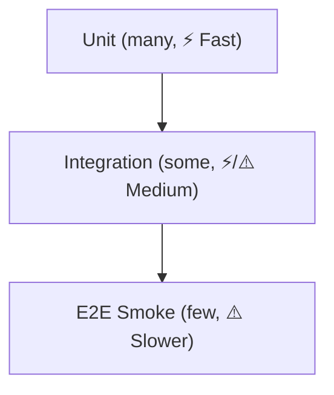

<!--
title: '🧪 TESTING STRATEGY'
description: 'The layered testing strategy from unit tests to end-to-end validation.'
tags: [testing, strategy, quality, coverage]
category: docs
-->

<!-- markdownlint-disable MD041 -->
<div align="center">

# 🧪 TESTING STRATEGY

<a name="top"></a>

**Hardening the codebase through multi-layered automated verification.**

_Hermetic environments. Deterministic suites. Zero-flake philosophy._

</div>

---

## 🎯 Our Strategic Intent

We treat tests as a first-class deliverable. Our goal is to catch defects at the lowest possible level to maintain high velocity and low regression risk.

- **Catch Early**: Unit and Integration tests run on every push.
- **Validate Globally**: End-to-End (E2E) smoke tests should gate promotion to `Preview` and `Release` - the template ships no application code, so wiring the E2E layer to your app is a Day-0 task.
- **Stay Deterministic**: We use pinned versions and locked environments to ensure "it works on my machine" translates to "it works in CI."

---

<strong>🧱 Test Types & When to Use Them</strong>

| Type                                     | Purpose                                              | Scope & Environment                          | Primary Tools                  | Speed        |
| ---------------------------------------- | ---------------------------------------------------- | -------------------------------------------- | ------------------------------ | ------------ |
| **Unit**                                 | Prove a function/module behaves as designed          | In-process only; mocks for I/O               | Vitest/Jest                    | ⚡ Fast      |
| **Integration**                          | Verify boundaries (HTTP handlers, data layer, rules) | App + local **emulators/containers**         | Supertest, MSW, Testcontainers | ⚡/⚠️ Medium |
| **E2E (Smoke)**                          | Prove critical user journeys                         | Deployed app (**Preview**) with real browser | Playwright/Cypress             | ⚠️ Slower    |
| **E2E (Regression)**                     | Wider coverage for high-risk areas                   | **Preview** or ephemeral env                 | Playwright/Cypress             | 🐢 Slowest   |
| **Contract (Optional)**                  | Prevent breaking API changes                         | Consumer/Provider stubs                      | Pact/Pactflow                  | ⚠️ Medium    |
| **Performance/Accessibility (Optional)** | Performance budgets / a11y checks                    | Lab checks on **Preview**                    | Lighthouse/axe                 | ⚠️ Medium    |

> [!TIP]
> Favor **Unit → Integration → targeted E2E**. Keep the "Test Pyramid" steep to preserve speed.

---

<strong>⛰️ Test Pyramid (concept)</strong>



---

<strong>🗺️ Where Tests Run in the Pipeline</strong>

| Stage                          | What runs                                              | Gate                                                            |
| ------------------------------ | ------------------------------------------------------ | --------------------------------------------------------------- |
| **Push/PR → Experimental**     | Unit, Integration (Emulators), Lint, Build             | Must pass to merge to **Experimental** and to proceed with work |
| **Pull Request → Development** | Unit, Integration (Emulators), Lint, Build             | Must pass to merge into **Development**                         |
| **Push → Preview**             | E2E Smoke (critical flows), optional a11y/perf budgets | Must pass to **promote**                                        |
| **Promote → Release**          | (Optional) E2E Regression on candidate, tag + notes    | Must be green to **tag**                                        |

> [!NOTE]
> **Experimental** is CI-only (no deploy). Use it to de-risk architectural spikes behind feature flags before opening a Pull Request (PR) to **Development**.

---

<strong>🔧 Tooling & Baseline Config</strong>

### Vitest/Jest (Unit/Integration)

`package.json` (excerpt)

```jsonc
{
  "scripts": {
    "test": "vitest run",
    "test:watch": "vitest",
    "test:unit": "vitest run -t unit",
    "test:int": "vitest run -t integration",
  },
}
```

Vitest example (`vitest.config.ts`)

```ts
import { defineConfig } from 'vitest/config';
export default defineConfig({
  test: {
    globals: true,
    coverage: {
      reporter: ['text', 'lcov'],
      lines: 80,
      branches: 75,
      functions: 80,
    },
    environment: 'node',
    setupFiles: ['./test/setup.ts'],
  },
});
```

### Playwright (E2E)

`playwright.config.ts`

```ts
import { defineConfig, devices } from '@playwright/test';
export default defineConfig({
  timeout: 60_000,
  retries: 1,
  use: {
    baseURL: process.env.PREVIEW_URL || 'http://localhost:5173',
    trace: 'retain-on-failure',
    screenshot: 'only-on-failure',
    video: 'retain-on-failure',
  },
  projects: [{ name: 'chromium', use: { ...devices['Desktop Chrome'] } }],
});
```

---

<strong>🔌 Worked Example: Backend Emulators (Integration)</strong>

Prefer local emulators or containers over cloud resources: they give high-fidelity environments with zero billing and no shared state. The commands below show a **Firebase-stack example** - substitute your platform's equivalent (Testcontainers, LocalStack, `docker compose up db`):

```bash
firebase emulators:start --only firestore,auth,functions &
npm run test:int
```

> [!IMPORTANT]
> Whatever the stack: **test security rules/policies against the real enforcement engine** (e.g., `@firebase/rules-unit-testing`, database-level RLS tests). Mocking security logic is prohibited - it produces false confidence.

---

<strong>🧰 Test Data, Isolation & Seeding</strong>

- **Self-contained tests**: every test seeds the data it needs and never depends on execution order or another test's leftovers.
- **Factories over fixtures**: generate records with factory helpers so schema changes break one function, not fifty JSON dumps.
- **Reset between suites**: truncate tables or clear the emulator between suites; a dirty baseline is the top source of flakes.
- **Never touch shared or production data** - ephemeral identities and datasets only.

---

<strong>🧪 Writing Good Tests</strong>

- **Arrange-Act-Assert**: clear structure and naming.
- **One behavior per test**; prefer multiple small tests to "kitchen-sink".
- **Avoid time/nondeterminism**: fake timers, mock network clock.
- **Assertions**: meaningful messages; snapshot only for stable, reviewed output.
- **Mocks/Stubs**: use **MSW** or lightweight fakes; avoid over-mocking core logic.

Example (Vitest)

```ts
test('returns 201 on valid payload', async () => {
  const res = await app.inject({
    method: 'POST',
    url: '/api/items',
    payload: { name: 'x' },
  });
  expect(res.statusCode).toBe(201);
});
```

---

<strong>📏 Coverage & Quality Gates</strong>

| Metric    |                Threshold | Notes                                     |
| --------- | -----------------------: | ----------------------------------------- |
| Lines     |                      80% | Project-wide; do not chase vanity numbers |
| Branches  |                      75% | Focus on risky logic/edges                |
| Functions |                      80% | Critical modules may set higher           |
| E2E Smoke | 100% of top 3 to 5 flows | Login, happy purchase, critical write     |

> [!TIP]
> Enforce thresholds in `vitest.config.ts` and fail CI when regressions occur.

---

<strong>🧯 Flake Policy</strong>

- **Unit/Integration**: `retries = 0`; flakiness must be fixed.
- **E2E**: `retries = 1` with trace/screenshot/video on failure.
- Track a **flaky allowlist** separately; open tickets for removal; keep small and temporary.

---

<strong>🧪 Local Developer Workflow</strong>

```bash
# Unified entrypoint - same suite CI runs
npm test

# Focused loops (wire these scripts to your framework)
npm run test:watch
npm run test:unit

# Integration against local emulators/containers (example stack)
npm run test:int

# E2E against a running app or Preview URL
npx playwright test
```

---

<strong>🧭 CI Layout (including Experimental)</strong>

- `checks.yml` (shipped): its `ci` job is the **🧪 Lint, Test & Build** required check - your `test-command` runs on pushes and PRs to all four long-lived branches.
- `preview-deploy.yml` (shipped): build → deploy **Preview** via its placeholder step. Append your Playwright **smoke** suite after the deploy step so bad candidates never reach `Release`.
- `release.yml` (shipped): draft → publish → package, as three jobs calling the release chain. Add an optional Playwright **regression** job before your production deploy hook.

**The shipped trigger in `checks.yml`:**

```yaml
on:
  push:
    branches: ['Experimental', 'Development', 'Preview', 'Release']
  pull_request:
    branches: ['Experimental', 'Development', 'Preview', 'Release']
  schedule: # weekly link-integrity sweep only
    - cron: '0 3 * * 0'
  workflow_dispatch:
```

> [!NOTE]
> **There is no shipped test suite, and that is deliberate.** `ci.yml` runs the `test-command` you give it, or a `Makefile` `test` target if you have one. A scaffold cannot guess whether your tests are `go test`, `pytest`, or `npm test`, so it asks rather than assumes - and it **fails** when lint, test, and build all resolve to nothing, so an unconfigured repository cannot sit green while checking nothing. The suites this guide describes are yours to add; nothing here competes with them.

> [!TIP]
> Use `concurrency` to cancel stale runs, and upload Playwright artifacts on failures.

---

<strong>🔐 Security in Tests</strong>

- Generate **ephemeral** test users/tokens; never reuse production identities.
- Mask/redact secrets in logs; mark artifacts as sensitive when uploading.
- Validate **secret scanning** and **Software Composition Analysis (SCA)** results before merge.

---

<strong>✅ Definition of Done (Testing)</strong>

- CI green on **Experimental** and **Development** (install → lint → test → build).
- E2E **smoke** green on **Preview** for user-critical paths.
- Adequate coverage on changed areas; risks documented in PR.
- No **new** flaky tests; artifacts attached for any failures.

---

<strong>❓ Frequently Asked Questions (FAQ)</strong>

- **Why run tests on Experimental?**
  To fail fast on spikes and prototypes without polluting **Development**. It keeps downstream PRs smaller and safer.

- **Do we snapshot UI?**
  Only for stable components with reviewed diffs; otherwise prefer explicit assertions.

- **Can Integration hit real services?**
  Prefer emulators/mocks. If unavoidable, isolate behind a feature flag and run in a separate, non-blocking job.

---

### 🔗 See also

> [!TIP]
> Every canonical guide is indexed in the [&#x1F4DA; Standards Index](https://github.com/tannergolden/standards/blob/Development/docs/README.md). If you rename or move a file, update every reference to it across the repository to prevent link drift.

---

<div align="center">

**Tested for integrity. Hardened for scale.**

[↑ Back to Top](#top)

<br />

Built with ❤️ by the Engineering Team. Distributed under the MIT License.

</div>
