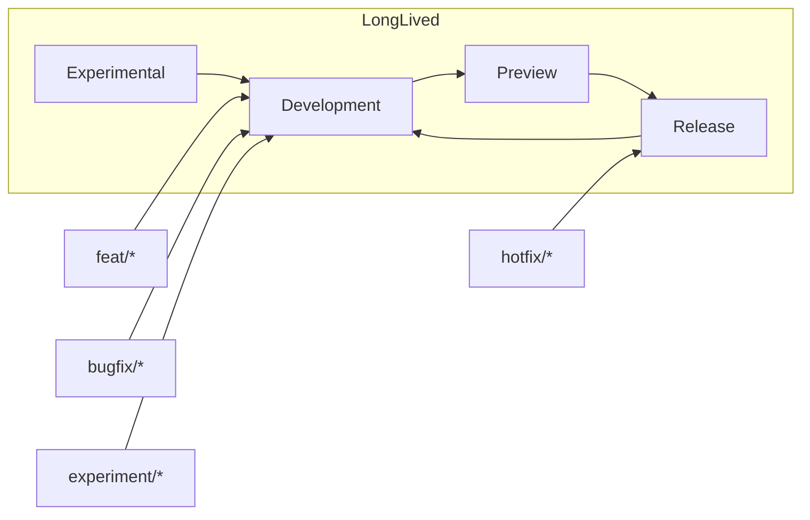
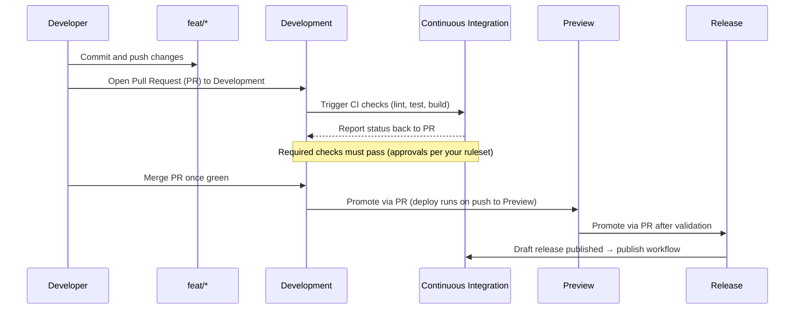

<!--
title: '🌟 GUIDING PRINCIPLES'
description: 'The engineering principles that govern how repositories on these standards are built and maintained.'
tags: [principles, culture, standards, engineering]
category: docs
-->

<!-- markdownlint-disable MD041 -->

# 🌟 GUIDING PRINCIPLES

**The non-negotiable culture of engineering excellence.**

_Standardized, automated, and AI-augmented engineering excellence._

---

## 🎯 Core Philosophy

These principles guide every decision we make - from architectural spikes to daily commits. They are designed to help us build better products, faster, and more sustainably.

> [!IMPORTANT]
> Adherence to these principles is mandatory. They ensure consistency across the codebase and allow AI agents and humans to collaborate without friction.

1. **AI-Human Collaboration First**
   We build systems that are legible and actionable for both humans and AI.
   - ✅ **Do:** write machine-readable documentation; use structured commit messages; maintain an up-to-date agent & contributor guide.
   - 🚫 **Avoid:** tribal knowledge, unstructured "brain dumps," and siloed decision-making.

2. **Ship small, reviewable changes**
   Thin vertical slices get faster feedback and safer deploys.
   - ✅ **Do:** keep Pull Requests (PRs) focused on a single intent; favor < 300 net Lines of Code (LOC) across ≤ 10 files; write clear titles/descriptions.
   - 🚫 **Avoid:** “kitchen-sink” Pull Requests (PRs), drive-by refactors, and mixing formatting with logic changes.

3. **Automate the boring & error-prone**
   Make the happy path one command locally and in Continuous Integration (CI).
   - ✅ **Do:** enforce formatters/linters/tests as required checks; align local environments with Continuous Integration (CI) via `Makefile` and scripts.
   - 🚫 **Avoid:** manual release steps, snowflake environments, and “works on my machine” setups.

4. **Readable over clever**
   Optimize for the next reader (including future you).
   - ✅ **Do:** name things well; keep functions small; comment the _why_; record decisions as Architecture Decision Records (ADRs).
   - 🚫 **Avoid:** cryptic abstractions, premature optimization, and hidden side effects.

5. **Security from the start**
   Bake security into everyday work - don’t bolt it on later.
   - ✅ **Do:** keep secrets out of Git; use secret managers; least-privilege tokens; enable secret scanning and Software Composition Analysis (SCA); review dependencies regularly.
   - 🚫 **Avoid:** personal tokens in Continuous Integration (CI), sharing credentials, or postponing rotations and dependency fixes.

6. **Reproducible builds**
   Anyone can build the same artifact and deploy it confidently.
   - ✅ **Do:** pin versions; commit lockfiles; build in CI; deploy the exact artifact you tested; tag releases; generate changelogs.
   - 🚫 **Avoid:** laptop builds for production, floating `latest` tags, and environment-dependent outputs.

7. **Default to transparency**
   Make context easy to find and decisions easy to audit.
   - ✅ **Do:** link issues/tickets in PRs; explain risks/rollout; document exceptions; capture post-incident actions.
   - 🚫 **Avoid:** private silos and silent process changes.

8. **Design for rollback and recovery**
   Every change should be easy to turn off, back out, or repair.
   - ✅ **Do:** gate changes with feature flags; use canary/percentage rollouts; make database migrations reversible; keep prior artifacts ready to redeploy.
   - 🚫 **Avoid:** irreversible schema changes, destructive data operations without backups, and “all-or-nothing” releases.

9. **Observability first**
   If you can’t see it, you can’t fix it.
   - ✅ **Do:** ship structured logs, metrics, and traces; define alerts tied to Service Level Objectives (SLOs).
   - 🚫 **Avoid:** debug-only logging, noisy non-actionable alerts, and silent failures.

10. **Documentation is a deliverable**
    Docs reduce rework and speed onboarding.
    - ✅ **Do:** maintain README files, task-focused docs, and ADRs close to code; update docs in the same PR.
    - 🚫 **Avoid:** stale pages, doc drift, and “will document later.”

11. **Clear ownership and accountability**
    Unowned code becomes broken code.
    - ✅ **Do:** keep CODEOWNERS accurate; assign a Directly Responsible Individual (DRI) for key areas.
    - 🚫 **Avoid:** ambiguous ownership and drive-by approvals.

12. **Dependency & upgrade hygiene**
    Third-party code is part of your system.
    - ✅ **Do:** pin versions; generate a Software Bill of Materials (SBOM); apply regular updates in controlled windows.
    - 🚫 **Avoid:** unbounded version floods and ignoring transitive risks.

---

## 🌊 Flow of Code

### Top-Level Topology

### Deployment Sequence

---

### 🔗 See also

> [!TIP]
> Every canonical guide is indexed in the [&#x1F4DA; Standards Index](https://github.com/tannergolden/standards/blob/Development/docs/README.md). If you rename or move a file, update every reference to it across the repository to prevent link drift.

---

**Engineering with intent. Scaling with confidence.**

[↑ Back to Top](#top)

 

Built with ❤️ by the Engineering Team. Distributed under the MIT License.

