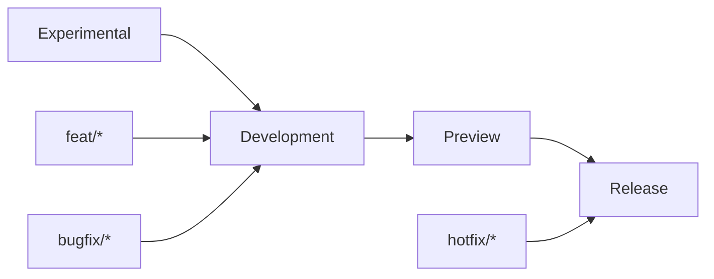

<!--
title: '🧠 GITHUB CONCEPTS RECAP'
description: 'A primer on the GitHub concepts, from branches to checks, that power this workflow.'
tags: [github, primer, workflow, reference]
category: docs
-->

<!-- markdownlint-disable MD041 -->
<div align="center">

# 🧠 GITHUB CONCEPTS RECAP

<a name="top"></a>

**A practical refresher on the Git/GitHub model: small branches, Pull Requests, Continuous Integration, and a clean promotion path.**

_Trunk-based development. Linear history. Automated promotion._

</div>

---

## 🎯 Our Mental Model

The repository serves as a **single source of truth** managed through a strict promotion lifecycle. We use local feature branches to propose changes, which are then validated by Continuous Integration (CI) and peer-reviewed via Pull Requests (PRs).

- **Experimental**: The CI-only spike line - the stable base beneath integration.
- **Development**: The active integration branch (and the default). All work starts and lands here.
- **Preview**: The staging environment. Used for validation and smoke testing.
- **Release**: The production line. Holds the canonical state of truth.

---

## 🧱 Core Concepts & Commands

| Concept     | Definition                                     | Essential Command               |
| :---------- | :--------------------------------------------- | :------------------------------ |
| **Commit**  | A permanent snapshot of changes with metadata. | `git commit -m "type: msg"`     |
| **Branch**  | An isolated line of development.               | `git switch -c feat/topic`      |
| **Remote**  | The central repository on GitHub (`origin`).   | `git push origin HEAD`          |
| **Staging** | The "waiting room" for the next commit.        | `git add <file>`                |
| **Rebase**  | Replaying your work on a new baseline.         | `git rebase origin/Development` |
| **Tag**     | An immutable label for a specific commit.      | `git tag v1.0.0`                |

---

## 🌿 The Propagation Path

We follow a linear promotion model where code moves "upwards" from integration to production.



> [!NOTE]
> Hotfixes may bypass `Development` for immediate recovery, but must be **back-merged** immediately after to prevent divergence.

---

## 🚦 Everyday Lifecycle

### 1. Start new work (feature)

```bash
git switch Development && git pull --ff-only
git switch -c feat/your-topic
```

### 2. Keep your branch up to date (rebase on Development)

```bash
git fetch origin
git rebase origin/Development   # or: git merge origin/Development
# resolve conflicts if any, then:
git push --force-with-lease
```

### 3. Open a Pull Request (PR)

- Target **Development**.
- Keep the PR small and single-purpose.
- Link tickets/docs; add testing notes and risk/rollback.
- Prefer **squash merge** to keep history tidy.

### 4. Update after review

```bash
# make edits...
git add -A
git commit -s -m "fix: address review feedback"
git push
```

---

## 🔀 Merging Strategies

| Action     | What it does                                        | When to use                                                    |
| ---------- | --------------------------------------------------- | -------------------------------------------------------------- |
| **Merge**  | Creates a merge commit combining histories          | General Git education - see the note below for this repository |
| **Rebase** | Replays your commits on a new base (linear history) | Updating a topic branch before merging                         |
| **Squash** | Collapses PR commits into one on merge              | Default for PRs: clean, readable history                       |

> [!NOTE]
> **In this template, squash is the only door.** The rulesets allow nothing but squash merges on the four protected branches, and init disables merge commits and rebase-merges repository-wide - the squash commit inherits the PR title and body, which is why the Semantic PR gate validates them.

> [!TIP]
> Use `--force-with-lease` (not `--force`) after a rebase to protect teammates' work.

---

### 🧰 Conventional Commits (for readable history & automated notes)

#### Format

```text
<type>(<scope>): <summary>

[optional body]

[optional footer(s)]
```

**Common types**: `feat`, `fix`, `docs`, `refactor`, `test`, `chore`, `build`, `ci`.

**Example**: `feat(auth): add passwordless sign-in`

---

### 🧨 Conflicts - how to resolve safely

1. **Fetch latest**: `git fetch origin`
2. **Rebase or merge** onto the target base (usually `origin/Development`).
3. **Edit conflict markers** (`<<<<<<<`, `=======`, `>>>>>>>`) and decide the correct result.
4. **Mark resolved**: `git add <files>`
5. **Continue**: `git rebase --continue` (or complete the merge).
6. **Run tests locally**, then `git push --force-with-lease` (if you rebased).

> [!CAUTION]
> Never commit conflict markers. Always run tests before pushing.

---

## 🧯 Safety & Recovery

| Goal                   | Safe command                  | Notes                                                       |
| ---------------------- | ----------------------------- | ----------------------------------------------------------- |
| Undo local edits       | `git restore <file>`          | Working tree only                                           |
| Unstage but keep edits | `git restore --staged <file>` | Moves back to working tree                                  |
| Revert a public commit | `git revert <sha>`            | Creates a new commit that undoes changes                    |
| Hard Reset (local)     | `git reset --hard <sha>`      | **Destructive**; use with care; don't do on shared branches |

---

### 🛰️ Sync a fork (if you use forks)

```bash
git remote add upstream https://github.com/<org>/<repo>.git
git fetch upstream
git switch Development
git rebase upstream/Development
git push --force-with-lease origin Development
```

---

### 📦 Tags & Releases

- Tag after promoting to **Release**: `git tag vX.Y.Z && git push --tags`
- Draft release notes from Conventional Commits; attach artifacts built by CI.

> [!NOTE]
> In this template the drafting and tagging are automated: `release-notes.yml` maintains one evolving draft per branch from your commit history, and `release-publish.yml` builds and attaches the artifacts when you publish it - manual tagging is the exception, not the routine.

---

## 🧩 Platform Features This Template Leans On

A refresher on the GitHub features the automation is built from - useful when a doc names one in passing:

| Feature                             | What it is                                                                                                              | Where it shows up here                                                                      |
| :---------------------------------- | :---------------------------------------------------------------------------------------------------------------------- | :------------------------------------------------------------------------------------------ |
| **Rulesets**                        | Branch protection as importable JSON (the modern successor to classic rules)                                            | `data/rulesets/`, applied by `apply-rulesets.sh` - PR-only, squash-only                                 |
| **Required check contexts**         | Job names a ruleset demands green before merge                                                                          | `🧪 Lint, Test & Build`, `🔍 Scan for Secrets`, `✍️ DCO Sign-Off`                           |
| **Environments**                    | Named deploy targets with their own secrets, reviewers, and branch gates                                                | `preview` and `release` (the latter created + gated at init)                                |
| **`GITHUB_TOKEN` vs PAT**           | The per-run workflow token vs a personal token with wider scopes                                                        | `BOT_ACCESS_TOKEN` lifts what the default token cannot do (workflow pushes, admin settings) |
| **Caller `permissions:` ceiling**   | A calling job's permissions cap what the workflow it calls may request - a missing scope fails the run before it starts | Every installed stub names the union of what its called workflow asks for                   |
| **`pull_request_target`**           | A PR trigger that runs with base-repo permissions, so fork PRs can receive statuses                                     | The Semantic PR gate and the governance jobs                                                |
| **Discussion category forms**       | YAML templates that structure a Discussion category, matched by category **slug**                                       | `.github/DISCUSSION_TEMPLATE/` (ten shipped categories)                                     |
| **Private vulnerability reporting** | A private Security-tab channel for coordinated disclosure                                                               | Enabled in code at init; the disclosure path in `SECURITY.md`                               |
| **Draft PRs**                       | A PR state that signals "not ready for review" while CI still runs                                                      | The recommended state until your checks are green                                           |
| **Auto-merge**                      | Merge automatically once required checks pass                                                                           | Dependabot PRs, via the `dependabot-automerge` stub, once required checks pass              |

---

### 🧪 Quick Command Cheat Sheet

```bash
# create & switch
git switch -c feat/<topic>

# stage & commit
git add -A
git commit -m "feat(scope): message"

# sync with Development
git fetch origin
git rebase origin/Development
git push --force-with-lease
```

---

### 🔗 See also

> [!TIP]
> Every canonical guide is indexed in the [&#x1F4DA; Standards Index](https://github.com/tannergolden/standards/blob/Development/docs/README.md). If you rename or move a file, update every reference to it across the repository to prevent link drift.

---

<div align="center">

**Collaborate with confidence. Commit with precision.**

[↑ Back to Top](#top)

<br />

Built with ❤️ by the Engineering Team. Distributed under the MIT License.

</div>
