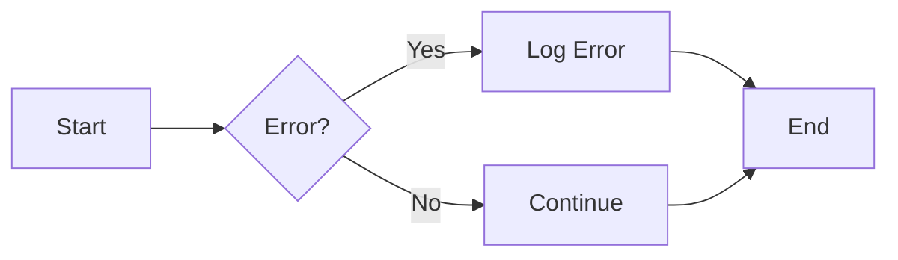

<!--
title: '📝 DOCUMENT STYLING & FORMATTING'
description: 'The binding specification for documentation styling, from headers and badges to footers.'
tags: [documentation, styling, specification, markdown]
category: docs
-->

<!-- markdownlint-disable MD041 -->
<div align="center">

# 📝 DOCUMENT STYLING & FORMATTING

<a name="top"></a>

**The binding specification for documentation styling, from headers and badges to footers.**

_One visual language. Zero deviation._

</div>

---

## 🎯 Directives & Intent

Our documentation is more than just text; it is a **visual engine** designed for both human readability and Artificial Intelligence ingestion. Every file must follow a predictable, centered header pattern to ensure a premium, unified experience.

### Mandatory Standard

**All newly generated documentation** - whether created by human contributors or AI agents - **MUST** strictly adhere to the styling, formatting, and structural patterns defined in this guide.

- **Approved vocabulary**: Every visual element detailed herein (Headers, Badges, Tables, Alerts, Footers, Diagrams, Interactive Elements) is explicitly approved for use. Use the ones a document needs; none of them is mandatory on its own.
- **Consistency over decoration**: Where you use an element, follow the form defined here rather than inventing a variant. A change to the form belongs in this specification first.

### What Is Enforced Mechanically, And What Is Not

This repository has no configurable style profile and no `docs-style` checker.
It also publishes its workflows rather than running them on itself, so the
column below says where each rule is actually checked, and admits where the
answer is nowhere:

| Rule                            | Checked by                                                        |
| :------------------------------ | :---------------------------------------------------------------- |
| Machined indexes match the tree | `scripts/update-doc-indexes.py --check`, run here on demand       |
| Label reference matches registry | `scripts/update-label-docs.py --check`, run here on demand        |
| Spelling                        | `typos`, in `ci.yml`, in consuming repositories                    |
| Links resolve                   | `lychee`, in `ci.yml`, in consuming repositories                   |
| Hidden frontmatter, comment form | Convention. Upheld by review                                      |
| Exactly four `tags`             | Convention. Upheld by review                                      |
| No `_` as a space in a filename | Convention. Upheld by review                                      |

Everything else in this specification - the badges, the centered headers, the
taglines, the fully-capped titles - is **convention, followed by hand**. It is
written down so it stays consistent, not because something rejects a document
that departs from it. Where a rule protects meaning rather than appearance, it
is in the table above.

### Core Principles

- **Visual Impact**: Use centered headers and high-contrast badges to create a high-fidelity feel.
- **Artificial Intelligence Optimization**: Keep structures machine-readable while maintaining aesthetic appeal.
- **Standards Enforcement**: Adhere strictly to the defined "these standards" for document composition. The subset a machine can verify is listed above, with the script that verifies it; the rest is upheld by writing it down and following it.

---

## 📁 File Naming & Title Case

Documentation names are **Capitalized-Kebab, always** - these are substance rules, upheld by review:

- **Filenames** under `docs/` capitalize every hyphen-separated word - `Branching-Strategy-&-Workflow.md`, like `Example.md` - never `EXAMPLE.md`, never `example.md`, never spaces, never underscores (`RESEARCH_LOG.md` ❌). The conjunction is always the ampersand: write the word `And` as `&` (`Pull-Requests-&-Code-Reviews.md`, never `Pull-Requests-And-Code-Reviews.md`); drop parentheses. Established acronyms keep their casing: `AI-Driven-Commit-Process.md`, `ADR.md`, `CI-CD-Pipelines.md`, `GitHub-Concepts-Recap.md`.
- **Fully upper or fully lower only where the platform requires it**: `README.md` as a directory index, GitHub's community-health and template names (`CONTRIBUTING.md`, `pull_request_template.md`, `ISSUE_TEMPLATE/config.yml`), discussion forms that must match their category slugs, and tool-required names (`_config.yml`). Everything with a free choice of name is Capitalized-Kebab.
- **No `_` as a space, anywhere in the repository**: the checker walks the **entire tree** - scripts, configs, workflows, everything - and rejects any file or directory name with an internal underscore. The only exceptions are names a platform or language fixes: GitHub magic files (`pull_request_template.md`, `CODE_OF_CONDUCT.md`, `ISSUE_TEMPLATE/`), leading-underscore tool names (`_config.yml`, `_typos.toml`, `_layouts/`), and Python modules that must stay importable because module names cannot contain hyphens.
- **Templates take their name - and their nature - from their folder**: in a repository generated from the template, every fill-in document (one carrying bracketed `REPLACE_ME`-style placeholders or either-or choices) lives under `docs/templates/`, and the location **is** the contract - so those files carry no in-file "this is a template" directive. They are copied in once and owned there afterwards; nothing syncs them back. Files inside `docs/templates/` never contain the word "template" in their name: `Implementation-Plan.md`, not `Implementation-Plan-Template.md`.
- **Titles and H1s are FULLY CAPPED, with `&` as the conjunction**: `📝 DOCUMENT STYLING & FORMATTING` - never the spelled-out word `AND`. The filename stays Capitalized-Kebab while the display title carries the spec's visual weight. (`AGENTS.md` and the AI router files keep their Title-First mixed case.) Unlike the filename rules above, title capping is an **aesthetic** rule and is not machine-checked.
- **Renames ripple**: changing a filename means updating every reference to it across the repository in the same change - raw, `%20`-encoded, and `&amp;`-escaped forms alike.

---

## 🗂️ Machined Indexes

Document lists that carry the `AUTO-INDEX` markers (the docs-home index and the workflow hub's category lists) are **generated, never hand-maintained** - hub tables without markers remain hand-curated, and the Distill-Lessons prompt sweeps them for drift. Content between the markers is machine-owned:

```markdown
<!-- AUTO-INDEX:BEGIN dir=<path under docs/> style=<list|table> -->
<!-- AUTO-INDEX:END -->
```

`scripts/update-doc-indexes.py` regenerates every block from the tree plus each document's own frontmatter (title emoji as hex entities, description as the table blurb). Run `python3 scripts/update-doc-indexes.py --write` after adding, renaming, or removing a doc, and `--check` to fail on a stale index, so an index need never silently disagree with the tree. Never edit between the markers by hand - edit the surrounding prose freely.

---

## 🗂️ Frontmatter Metadata

Every Markdown document MUST begin with metadata carrying machine-readable
information for search and AI discovery, **wrapped in an HTML comment**:

```markdown
<!--
title: '📝 DOCUMENT TITLE'
description: 'A single, specific sentence describing what this document covers.'
tags: [topic-one, topic-two, topic-three]
category: docs
-->
```

> [!IMPORTANT]
> **Frontmatter is always hidden. Never use `---` fences.** A document fenced
> with `---` renders its metadata as a **visible table at the top of the page**
> on GitHub - the first thing every reader sees is a block of machine
> bookkeeping rather than the document. The comment form is invisible when
> rendered, identical when parsed, and byte-for-byte the same YAML inside.
>
> This is not a preference about neatness. GitHub is where these documents are
> actually read, and a static-site generator that wants `---` fences is a
> generator that can be configured to read the comment form instead. The
> renderer nobody configures wins.

- **The delimiters are `<!--` and `-->`**, each alone on its own line, opening
  the file with no blank line before them.
- **The body is YAML** and is parsed as YAML by anything that reads it, so the
  same key rules apply as they always did.
- **description**: one specific sentence (never empty, never generic).
- **tags**: **exactly four** kebab-case topical tags - no more, no fewer.
  Four is enough to place a document on more than one axis (subject, area,
  mechanism, audience) and few enough that the list stays a classification
  rather than a keyword dump. An open-ended list drifts: documents accrete
  tags nobody prunes until the vocabulary means nothing.
- **No `-->` inside the block**, which would terminate the comment early. In
  practice nothing legitimate in a title, description, or tag list contains it.
- **Exemption**: `.github/pull_request_template.md` carries no frontmatter **and no decorative header/footer** - GitHub inserts the template verbatim into every new pull-request body, where frontmatter, badges, and taglines would appear as noise. Only the integrity rules (encoding, prompt hygiene, alt text) apply to it.

---

## 🧱 Header Composition Matrix

Every primary documentation file (README, major guides) MUST use the following centered header block.

> [!NOTE]
> Artificial Intelligence Documentation (`AGENTS.md`, `CLAUDE.md`, etc.) follows a specialized "Title-First" structure detailed in the [Artificial Intelligence Documentation Structure](#-artificial-intelligence-documentation-structure) section.

### Structure Specification

```markdown
# [Emoji] [Title]

<a name="top"></a>

**[Descriptive paragraph in bold.]**

_[Tagline in italics.]_

[Badges]
```

| Element               | Specification                         | Description                                                                                            |
| :-------------------- | :------------------------------------ | :----------------------------------------------------------------------------------------------------- |
| **Lint Suppression**  | `<!-- markdownlint-disable MD041 -->` | Required as the first line after the frontmatter comment, allowing the centered `div` before Heading 1. |
| **Div Open**          | `<div align="center">`                | Centers all contained elements.                                                                        |
| **Emoji + Heading 1** | `# 🚀 Feature Name`                   | The primary document title.                                                                            |
| **Top Anchor**        | `<a name="top"></a>`                  | Enables the "Back to Top" footer links.                                                                |
| **Description**       | `**Bold Text**`                       | A 1-2 sentence overview of the document's purpose.                                                     |
| **Tagline**           | `_Italicized Text_`                   | **Unique Requirement:** A high-level principle specific to _this_ file. Do not reuse generic taglines. |
| **Badges**            | Shields.io Images                     | **Optional.** If a document carries them, the palette and placement rules below apply.                 |
| **Div Close**         | `</div>`                              | Closes the centered block, after the badges where there are any.                                       |

> [!NOTE]
---

## 🎨 Badge Visual Standards

To maintain a consistent visual language, badges must adhere to a strict color palette. We distinguish between **Static** (Black Label) and **Dynamic** (Gold Label) badges.

### Agnostic Configuration

To ensure the repository template remains portable and new documentation does not break when cloned, use the following linking strategies:

- **Static Badges**: Use **Relative Paths** (e.g., `./`, `../../LICENSE`, `../distribution/`) for the link target. This ensures the badge works immediately upon cloning, regardless of the folder name.
- **Dynamic Badges**: Use **Placeholders** for external API calls. Replace `[OWNER]` and `[REPO]` with your actual GitHub details during the project initialization phase.

### Global Parameters

> [!NOTE]
> **Self-hosted where it matters.** A badge served from `img.shields.io` is a third-party request on every page view, and a dependency on someone else's uptime for your README to render. Committed SVGs avoid both. This repository publishes no badge renderer, so the parameters below are the **specification vocabulary**: read them as the shape a badge should take, whether you generate it or hand-write it.

All shields.io links **MUST** include the following query parameters:

**1. Static Identifiers (Standard)**

- `style=for-the-badge` (Enforces **BOLD CAPS** text)
- `labelColor=000000` (**Black** background for high contrast)
- `logoColor=white`

**2. Dynamic Health Metrics (Live Data)**

- `style=for-the-badge` (Enforces **BOLD CAPS** text)
- `labelColor=C0A062` (**Metallic Gold** background for live status)
- `logoColor=white`

### Official Color Palette

Use these specific Hexadecimal codes to denote the nature of the badge content.

| Usage Context              | Hexadecimal Code | Color Name         | Meaning                                                             |
| :------------------------- | :--------------- | :----------------- | :------------------------------------------------------------------ |
| **Navigation / Standard**  | `**3366FF**`     | **Electric Blue**  | General documentation, status, or informational links.              |
| **Roles / Specifications** | `**FE5196**`     | **Hot Pink**       | Defining the "Type" of document (e.g., Guide, Specification, Rule). |
| **Security / Critical**    | `**D73A49**`     | **Alert Red**      | Security policies, hardened statuses, or warnings.                  |
| **Context / Technology**   | `**9C27B0**`     | **Deep Purple**    | Technical domains, AI context, or specific technologies.            |
| **License / Legal**        | `**F1E05A**`     | **Warning Yellow** | Licensing, legal disclaimers, or compliance.                        |
| **Success / Active**       | `**2EA043**`     | **Success Green**  | Active maintenance status or passing builds.                        |
| **Dynamic Health**         | `**C0A062**`     | **Metallic Gold**  | **REQUIRED** for live metrics (Builds, Commits, Version).           |

The self-hosted Badge Kit ships a full designed palette - a rainbow plus the popular colors, all tuned to one saturation/lightness family so any two synergize - and a raw `#RRGGBB` works anywhere a token does. A **static** badge (black label) may use any of them.

### Badge Health Colors (Traffic-Light Rule)

A **dynamic-health** badge (the metallic-gold label) uses color to represent a **status**, so its message color is restricted to the **traffic-light triad** - never an arbitrary hue:

- 🟢 **`green` (`2EA043`)** - healthy: passing, active, fresh, high score.
- 🟡 **`yellow` (`F1E05A`)** - degraded: aging, partial, mid score.
- 🔴 **`red` (`D73A49`)** - failing: broken, stale, low score.
- ⚪ **`slate` (`57606A`)** - reserved for an explicit "no status yet" (unknown / not measured), which does not represent a status.

Nothing checks this automatically; it holds because it is written down. Static badges are unconstrained - only status signals are, so green, yellow and red read the same everywhere they appear.

### Badge Composition, Where Badges Are Used

**Badges are optional.** Most documents in this repository carry none, and that is not a defect - a badge earns its place by saying something a reader could not get from the title. Where a header does carry them, four static badges are the conventional set:

1. **Status / Link Badge**: Indicates status and links to the local root (`./`). (Use **Blue** or **Green**)
2. **Identification Badge**: Defines the document role. (Use **Pink**)
3. **Context Badge**: Defines the domain or layer. (Use **Purple** or **Red**)
4. **License / Legal Badge**: The standard MIT license badge linking to the local license file. (Use **Yellow**)

> [!TIP]
> **Keep badges specific to the document.** A copy-pasted badge set says nothing, which is the usual reason a header full of them is worse than a header with none.
>
> - **Identification Badge**: Must uniquely define the file (e.g., `Role: Specification` vs `Role: Guide`).
> - **Context Badge**: Must reflect the specific technical domain (e.g., `Context: Security` vs `Context: Database`).
> - **Avoid Generics**: Never use generic labels like "Docs" or "Info" that do not distinguish the specific file.
> - **No duplicate badges within a document**: A document must never show the **same badge twice**. A second masthead, or a gallery that re-displays a header badge, is a duplicate. A repeat is only tolerable in an identical context and is discouraged even then, so give each badge a distinct identity or remove the copy. (Badge markdown shown as an _example_ inside a code fence or inline code does not count.)

### Badge Placement (Alignment)

Where a badge sits decides how it is aligned:

- **Header badges are centered.** The centered header block (`<div align="center">`) carries the document's identity badges, exactly as the header matrix specifies.
- **Body badges are left-aligned.** A badge that appears in the document **body** (anywhere after the header) MUST flow with the body text, never wrapped in an `align="center"` container. Left alignment reads as content, not a second masthead. (Centered **diagrams** and screenshots are unaffected; this rule is about badges.)

### Health Dashboards (Root & Community Health Files)

A root `README.md` and the community health files (`CONTRIBUTING.md`, `CODE_OF_CONDUCT.md`, `SECURITY.md`, `SUPPORT.md`, `GOVERNANCE.md`) are the documents where badges most often do earn their place, because a reader arriving there wants operational state at a glance. The convention is a static identity row, then a **dynamic-health row** beneath it. This is a pattern to follow if you want it, not a requirement.

| Category                | Badges                                                                       | Label Style                 | Link Strategy                                                             |
| :---------------------- | :--------------------------------------------------------------------------- | :-------------------------- | :------------------------------------------------------------------------ |
| **Static / Navigation** | Documentation Link, License, Project Status, Role                            | `labelColor=000000` (Black) | **Relative** (`./`)                                                       |
| **Dynamic / Health**    | Continuous Integration Status, Docs-Site Deploy Status, Last Commit Activity | `labelColor=C0A062` (Gold)  | **Repository tabs** (Actions/commits/deployments; init rebrands the URLs) |

**If you build one, these are the rules it follows.** A health dashboard is a
choice, not an obligation - a repository with no badges anywhere is following
this specification correctly.

1. **Root dashboard, live data**: Where the root `README.md` carries a dashboard, prefer **dynamically updating** badges (GitHub Actions build status, CodeQL analysis, last commit date) over static ones. A badge that cannot go red is decoration; the whole value of a dashboard is that it can.
2. **Community health files, best-fit trio**: A community health file that carries dynamic-health badges conventionally carries **three**, chosen to fit that file's subject (contribution gates on `CONTRIBUTING.md`, disclosure posture on `SECURITY.md`, and so on). A file MAY reuse a live top-level badge where it best fits (for example `SECURITY.md` carrying the daily-refreshed OpenSSF Scorecard); the remaining badges are committed **posture** badges: a stable status expressed in the health palette (gold label, traffic-light color) rather than a machine-measured metric. Posture badges live under `assets/badges/static/` like the classification badges and are referenced by their absolute raw URL, so they render in every GitHub view.
3. **Gold label for live data**: A dynamic health badge uses the **Metallic Gold** (`C0A062`) label color to distinguish live data and posture from static navigation links, and their message color is bound by the traffic-light rule above.
4. **Repository Context**: A live badge's link points to the actual Actions or Security tab of the repository; a posture badge links to the same relative root target the file's static badges use.
5. **Ordering (below static, always)**: Dynamic health badges MUST sit on their **own row, below** the static badges, separated by a blank line. A single row must never mix the two kinds: the static identity row (status, role, context, license) comes first, the health row follows on the next row. This holds anywhere both kinds appear together, in the root header and every community health file alike. Blank-line-separated rows are independent, so a static **call-to-action** row (docs-site link, use-this-template) may follow the health row - the no-mixing rule binds within each row. Nothing checks this automatically.

---

## 🎭 Semantic Emoji Taxonomy

To ensure visual consistency and rapid scanning, use specific emojis to denote the _type_ of content being presented in headers or sections. Do not use emojis randomly.

| Emoji | Semantic Meaning           | Usage Context                                                     |
| :---- | :------------------------- | :---------------------------------------------------------------- |
| 🚀    | **Execution / Deployment** | Quick starts, launch scripts, release notes, run commands.        |
| 🤖    | **AI / Automation**        | Agent configurations, prompts, bot logic, skill indexes.          |
| 🛡️    | **Security / Auth**        | Credentials, secrets, policies, hardening guides, access control. |
| 📦    | **Artifacts / Storage**    | Databases, dependencies, Docker images, manifests, releases.      |
| 📝    | **Documentation**          | Guides, specs, logs, text-heavy resources, formatting rules.      |
| ⚙️    | **Configuration**          | Settings, environment variables, Makefiles, JSON/YAML configs.    |
| 🌿    | **Workflow / Git**         | Branching strategies, Pull Requests, version control, git hooks.  |
| 💡    | **Concepts / Context**     | "About" sections, principles, high-level theory, explanations.    |

---

### Technical Implementation Standards

To ensure 100% portability across diverse editors, terminal environments, and CI runners, all documentation MUST follow these technical encoding rules:

1. **Strict UTF-8 Encoding**: Every file in the repository (excluding binary assets) MUST be saved in **UTF-8 without a Byte Order Mark (BOM)**.
2. **Emoji Portability**:
   - **In Body Text**: Standard UTF-8 emojis are permitted for readability.
   - **In Templates & Critical Headers**: You **MUST** use HTML Hexadecimal Entities (e.g., `&#x1F680;` for 🚀, `&#x1F4DD;` for 📝). This prevents character corruption (mojibake) when documents are processed by scripts or viewed in legacy environments.
   - **Zero-Tolerance for Mojibake**: Corrupted sequences (the `Ã`-prefixed artifacts you get when UTF-8 is read as Latin-1) are prohibited and must be repaired on sight.
3. **No Em Dashes**: The em dash character (U+2014) is prohibited in every file the repository writes: prose, comments, configuration, and commit messages alike. Use a comma, a colon, parentheses, or a spaced hyphen (" - ") instead. In prose it is a convention upheld by review; in a commit message `commit-check` rejects it through the `no-em-dash` rule in `config/commitlint.config.js`, wherever that action runs.

---

## 🤖 Artificial Intelligence Documentation Structure

Root Artificial Intelligence router files (`AGENTS.md`, `CLAUDE.md`, `GEMINI.md`, `.cursorrules`, `.windsurfrules`) follow a specialized structure to optimize AI ingestion while satisfying strict linting rules (`MD041`).

### Core Specifications

1.  **Uniform Header Alignment**: Every documentation file MUST follow the standard header structure to ensure titles are centered.
2.  **Lint Suppression**: Line 1 MUST contain `<!-- markdownlint-disable MD041 -->`.
3.  **Centered Title**: Heading 1 MUST be positioned inside the `<div align="center">` block.
4.  **Metadata Location**: Machine-readable metadata remains in the footer metadata block.

### Visual Blueprint

```markdown
---
[Body Content]
---

<div align="center">

[Metadata (key: value)]

**Engineered for precision. Governed by logic.**

[↑ Back to Top](#top)

</div>
```

---

## 👨‍💻 Developer Experience (DX)

Documentation must be actionable and copy-paste friendly. We remove friction from the engineering workflow.

### Terminal Command Hygiene

**Never** include the leading command prompt (`$`, `>`, or `%`) in code blocks. This prevents users from accidentally copying the prompt, which causes the command to fail when pasted.

**❌ Incorrect:**

```bash
$ npm install
$ make setup
```

**✅ Correct:**

```bash
npm install
make setup
```

### Comment Placement

Place comments on the line **above** the code they describe, or use inline comments for short clarifications. Ensure comments are aligned for readability.

---

## 📊 Diagramming & Visualization

We prioritize **Code-as-Infrastructure** for visuals. Use [Mermaid.js](https://mermaid.js.org) for all workflows, sequence diagrams, and architecture maps. This ensures diagrams are version-controlled and AI-readable.

### Rich Media & Accessibility

- **GIFs & Motion**: For UI interactions or complex CLI flows, prefer short, looped GIFs (under 5MB) over static screenshots.
- **Alt Text**: All images, including badges, MUST have descriptive Alt Text (``) to ensure accessibility for screen readers and search indexing.

### Workflow Example



### Style Requirement

- **Direction**: Left-to-Right (`graph LR`) for workflows; Top-to-Bottom (`graph TD`) for hierarchies.
- **Simplicity**: Avoid complex styling classes; rely on standard geometry for readability.

---

## 🧼 Structural Elements

### Horizontal Rules

Use `---` (three dashes) to separate major sections. Ensure there is a blank line above and below the rule.

### Alerts

Utilize GitHub-style alerts sparingly to highlight critical information:

> [!IMPORTANT]
> Critical architectural requirements.

> [!TIP]
> Helpful patterns or shortcuts.

### Progressive Disclosure (Collapsible Blocks)

To maintain visual cleanliness, any code block, configuration file, or log output **exceeding 20 lines** MUST be wrapped in a collapsible detail tag to prevent scrolling fatigue.

<details>
<summary>Click to view full configuration example</summary>

```json
{
  "key": "value",
  "data": "This is a large data block that should be hidden by default."
}
```

</details>

### Interactive Task Lists

For procedural guides (e.g., Setup, Deployment, Troubleshooting), use GitHub-flavored interactive task lists. This allows users to mentally or physically track their progress through complex operations.

- [ ] Clone the repository
- [ ] Run the setup command
- [ ] Verify environment variables
- [ ] Execute build script

### User Inputs & Interface Elements

Use the HTML `<kbd>` tag to denote keyboard inputs or distinct User Interface buttons. This visual distinction reduces cognitive load.

- **Keyboard Shortcuts**: Press <kbd>Ctrl</kbd> + <kbd>C</kbd> to exit the process.
- **User Interface Elements**: Click the <kbd>Deploy</kbd> button to trigger the workflow.

### Directory Tree Structures

Use `bash` code blocks to render file trees. This preserves spacing and highlights comments for maximum clarity.

```bash
.
├── docs/                    # 📚 Documentation
├── src/                    # 📦 Source Code
└── Makefile                # ⚙️ Task Runner
```

### Code Blocks

Always specify the language for syntax highlighting.

```bash
make setup
```

---

## 🏁 Footer Composition

Every document should conclude with a centered footer providing navigation and attribution.

```markdown
**[Document Summary Phrase]**

[↑ Back to Top](#top)
```

**Contextual Uniqueness Rule:**
The **Document Summary Phrase** (bolded in the footer) must be unique to the document. It acts as the "closing argument" or mantra for that specific file. Do not use generic phrases like "End of file" or reuse the same footer across the repository.

---

## 🔗 See also

> [!TIP]
> Every canonical guide is indexed in the [&#x1F4DA; Standards Index](https://github.com/tannergolden/standards/blob/Development/docs/README.md). If you rename or move a file, update every reference to it across the repository to prevent link drift.

---

<div align="center">

**Standardized for logic. Engineered for scale.**

[↑ Back to Top](#top)

<br />

Built with ❤️ by the Engineering Team. Distributed under the MIT License.

</div>
